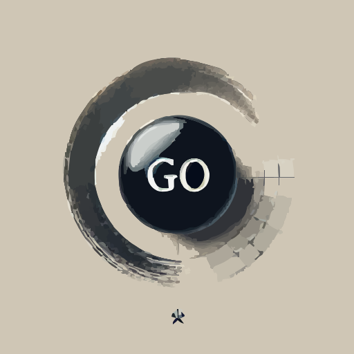

# GoTime
 
⚠️⚠️ README & Public demo in progress ⚠️⚠️


**GoTime** is a proof-of-concept multiplayer game of [Go](https://en.wikipedia.org/wiki/Go_(game)) built using [SpacetimeDB](https://spacetimedb.com/).

Thie repository contains a client app written in [React](https://react.dev/) and a server app written in [Rust](https://www.rust-lang.org/).

---

## Quick Overview

- **Fast Multiplayer**  
  Built with SpacetimeDB for rapid state updates and low-latency interactions.

- **Real-Time Game Analysis:**  
  Dynamic board analysis, scoring (area & territory methods), move legality checks, etc are performed on every move.

- **Game Rules:**  
  Our Game rules write-up can be found at [GO_RULES.md](/GO_RULES.md)

  For complete instructions on how to play Go, we recommend going to one of the more official sources online.


---

## Development


### Starting the Database

To start the database, run:

```bash
npm run db-up
```

## Using the Spacetime CLI via Docker

### Creating a Module

To create a new module using Rust:

```bash
npm run spacetime -- init --lang rust test-module
```

### Publishing a Module

This pushes your module to the running spacetimedb

```bash
npm run spacetime -- publish --project-path server quickstart-chat
```

## Generating Typescript Types

Generate the backend types into the directory `client/src/module_bindings`:

```bash
npm run generate
```

### Calling a Reducer

To call a reducer (e.g., sending a message):

```bash
npm run spacetime -- call quickstart-chat send_message 'Hello, World!'
```

### Viewing Logs

To view logs and verify that the reducer was called:

```bash
npm run spacetime -- logs quickstart-chat
```


